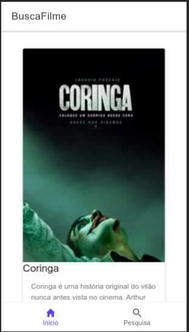
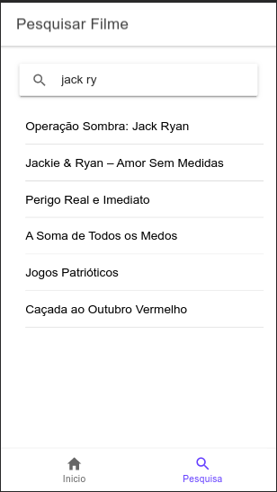

# Projeto BuscaFilme

BuscaFilme é um projeto de aplicativo inteiramente voltado a aprendizagem ao desenvolvimento de aplicativos com Ionic 4. Tem como funções a busca de filmes e listas utilizando a base de dados disponibilizada pela API do The Movie DB.  

# Telas





# Instalação 

```sh
$ git clone https://github.com/jpbbrito/busca-filme.git
```
Entre na pasta do projeto

```sh
$ cd busca-filme
```
Depois basta executar o comando abaixo para instalar a dependencias necessarias.

```javascript
$ npm install
```
Crie uma conta no The Movie DB e cópie o Token de acesso da API e adicione no arquivo **/src/environments/environment.ts** onde há a propriedade APIKEY. 

```
export const environment = {
  production: false,
  APIKEY: TOKEN_DE_ACESSO
};
```
E, pronto para testar no navegador.

```sh
$ ionic serve
```